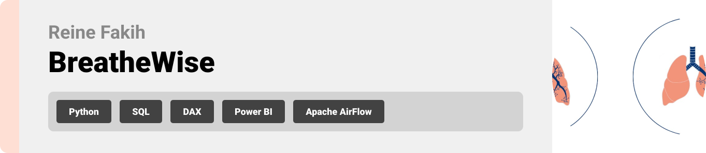
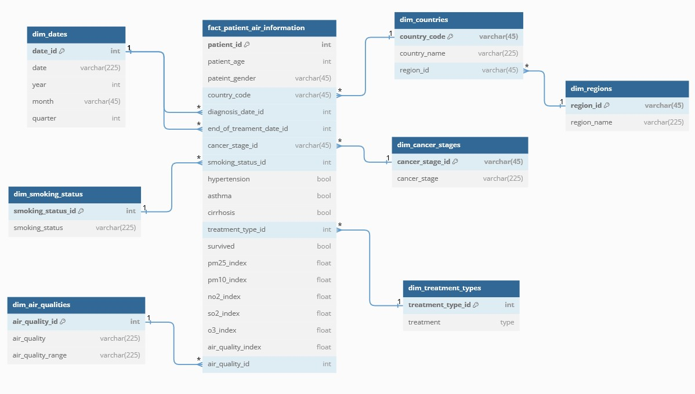
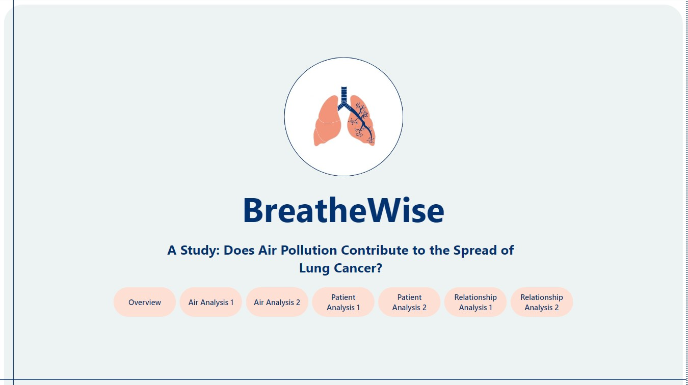
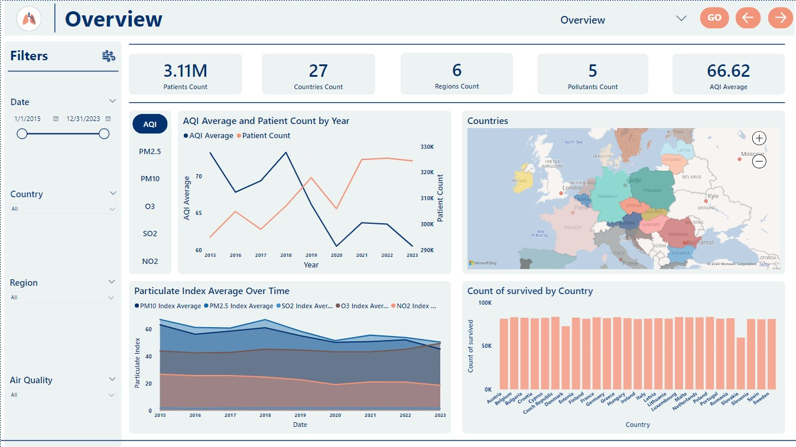
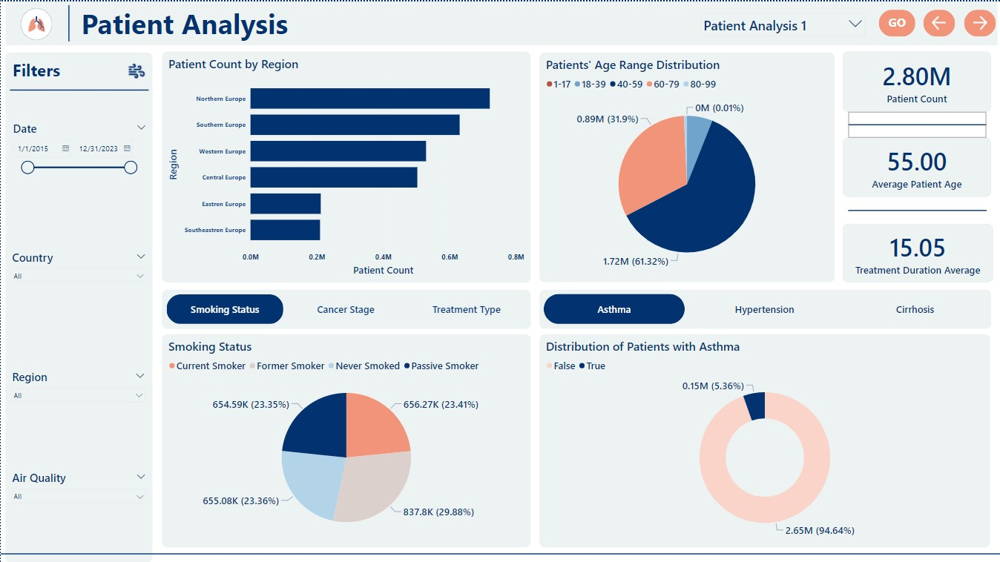
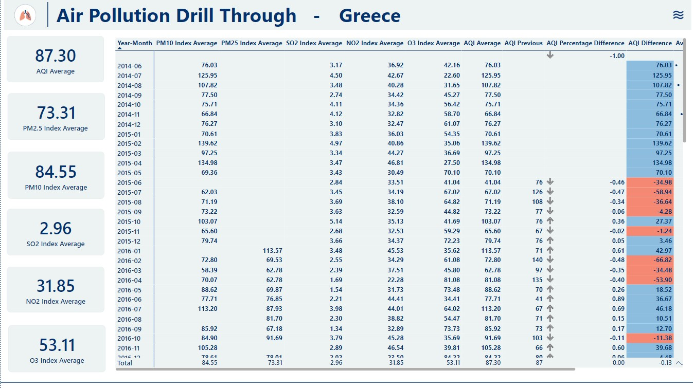
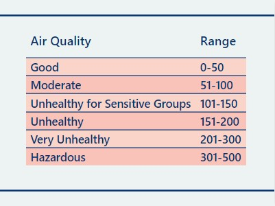

  

<!-- project philosophy -->

> This project aims to integrate data-driven insights to explore the relationship between air pollution and lung cancer in Europe. By analyzing trends in both air quality and lung cancer incidence, the project seeks to help researchers in the environmental and health sectors gain valuable insights into how pollution impacts public health.
>
> Combining a robust ETL pipeline, interactive dashboards, and time series forecasting, the project delivers actionable intelligence to support data-driven decision-making.

### User Stories
- **As a data engineer**, I want to build a robust ETL pipeline to process, clean, and store data in a warehouse so that I can provide a foundation for downstream analytics and visualizations.
- **As a data analyst**, I want to visualize air pollution and health data on interactive dashboards so that I can identify trends, correlations, and insights.
- **As a data scientist**, I want to develop a time series model to forecast air pollution across Europe, helping governments and organizations to take preventive action against environmental hazards.
- **As a healthcare researcher**, I want to analyze the survival probability of lung cancer patients based on various factors so that I can help doctors make more informed treatment decisions.

  
<!-- Tech stack -->

### BreatheWise is built using the following technologies:

- **[Python 3.12.4](https://docs.python.org/3/)**: A versatile programming language used for various aspects of this project, including:
  - **[Pandas](https://pandas.pydata.org/docs/index.html)** and **[NumPy](https://numpy.org/doc/)**: For data preprocessing and analysis, including time series analysis.
  - **[SQLAlchemy](https://docs.sqlalchemy.org/en/20/)**: To build and maintain the connection to the data warehouse for the ETL pipeline, including modifying and accessing the data.
  - **[pmdarima](https://alkaline-ml.com/pmdarima/modules/generated/pmdarima.arima.auto_arima.html)**: For utilizing the `auto_arima` model in forecasting (time series analysis).
  - **[Matplotlib](https://matplotlib.org/stable/index.html)**: For data visualization, generating plots and charts to display analysis results.
  - **[DVC](https://dvc.org/doc)** (Data Version Control): To manage and version control data files, ensuring consistent tracking of data throughout the project's lifecycle.
  - **Scripting the ETL Pipeline**: Python scripts are used to automate the extraction, transformation, and loading (ETL) of data into the warehouse.
- **[SQL (Structured Query Language)](https://en.wikipedia.org/wiki/SQL)**: Used for querying within the data warehouse to facilitate both the ETL pipeline and data analysis tasks.
- **[MySQL](https://dev.mysql.com/doc/)**: A relational database management system (RDBMS) used for:
  - Storing and managing data in the data warehouse and data marts.
  - Seamless integration with Python (via `SQLAlchemy` and other libraries) and Power BI for live querying and analysis.
- **[Airflow](https://airflow.apache.org/docs/)**: An open-source platform used for workflow orchestration. Airflow is employed to:
  - Manage, schedule, and monitor the ETL processes.
  - Automate and ensure the reliability of the entire data pipeline.
- **[Power BI](https://learn.microsoft.com/en-us/power-bi/)**: A business intelligence tool used for:
  - Creating interactive data visualizations and dashboards, allowing users to explore data interactively with drilldowns, filters, and slicers.
  - Visualizing live data that is directly extracted from the MySQL data warehouse.
  - **[DAX (Data Analysis Expressions)](https://learn.microsoft.com/en-us/dax/)**: The formula language used in Power BI for creating custom calculations, aggregations, and advanced metrics within the visualizations.

  

<!-- Database Design -->

###  Utilizing a Star-Flake schema in Data Warehouse Design:

1. **The Schema:** I will be utilizing ***dimensional modeling*** so that I can organize the data in a way that makes it easy to do analysis. From the dimensional models, I chose a mostly ***star schema***, with a bit of snowflake-ness to utilize performance.

2. **The Grain:** 

   - **Generally:** We are going with _**high granularity**_, each row represents one patient that has lung cancer,  the date they were diagnosed in, what cancer stage they have, what treatment they are going through, if they have any other illness that may also be related to air pollution (asthma -a chronic lung disease-, hypertension -high blood pressure-, cirrhosis -caused by liver damage-), if the patient survived the cancer or not, what country they are from and the economic state of the country, the air pollutants concentration, the air quality index and the air quality indicator (good, moderate, poor, etc.)
   - **Time Wise:** We will be using the **_month and year_** for the time which is a bit of a **_coarse-grained data_**, this here is due to the fact that if we want to analyze trends with pollution and relationship with lung cancer, doing it on a daily level would not give us any direct conclusions so I decided to go with monthly so we can notice the trends more and how pollution is varying from month to month and between the years and how it is affecting lung cancer patients.

3. **The Tables:**

   - **Fact Table:** 

     1. **`patient_id` (int, PK)**:
        - **Description**: Primary key for the patient. This is a unique identifier for each patient in the dataset.
     2. **`patient_age` (int)**:
        - **Description**: The age of the patient at the time of diagnosis or during treatment.
     3. **`patient_gender` (varchar(45))**:
        - **Description**: The gender of the patient, stored as a string (e.g., "Male", "Female").
     4. **`country_code` (varchar(45))**:
        - **Description**: The code representing the country the patient is from (e.g. "FR" for France).
     5. **`diagnosis_date_id` (int)**:
        - **Description**: Foreign key linking to a date dimension, representing the date when the patient was diagnosed with lung cancer.
     6. **`end_of_treatment_date_id` (int)**:
        - **Description**: Foreign key linking to a date dimension, representing the date when the patient completed their cancer treatment.
     7. **`cancer_stage_id` (varchar(45))**:
        - **Description**: The stage of cancer at the time of diagnosis (e.g., "Stage I", "Stage II").
     8. **`smoking_status_id` (int)**:
        - **Description**: Foreign key linking to a table that records the patient's smoking status (e.g., former smoker, passive smoker).
     9. **`hypertension` (bool)**:
        - **Description**: A boolean field indicating whether the patient has hypertension (true/false).
     10. **`asthma` (bool)**:
         - **Description**: A boolean field indicating whether the patient has asthma (true/false).
     11. **`cirrhosis` (bool)**:
         - **Description**: A boolean field indicating whether the patient has cirrhosis of the liver (true/false).
     12. **`treatment_type_id` (int)**:
         - **Description**: Foreign key linking to a table that contains the type of treatment the patient received (e.g., chemotherapy, radiotherapy).
     13. **`survived` (bool)**:
         - **Description**: A boolean field indicating whether the patient survived the treatment (true/false).
     14. **`pm25_index` (float)**:
         - **Description**: The PM2.5 air quality index, representing the level of fine particulate matter (particles with a diameter of 2.5 microns or less) the patient was exposed to.
     15. **`pm10_index` (float)**:
         - **Description**: The PM10 air quality index, representing the level of particulate matter with a diameter of 10 microns or less.
     16. **`no2_index` (float)**:
         - **Description**: The nitrogen dioxide (NO2) air quality index, representing the patient’s exposure to this pollutant.
     17. **`so2_index` (float)**:
         - **Description**: The sulfur dioxide (SO2) air quality index, representing the level of this pollutant in the patient’s environment.
     18. **`o3_index` (float)**:
         - **Description**: The ozone (O3) air quality index, representing the patient's exposure to ozone in their environment.
     19. **`air_quality_index` (float)**:
         - **Description**: The overall air quality index (AQI), summarizing various pollutants that the patient was exposed to during the treatment or diagnosis period.
     20. **`air_quality_id` (int)**:
         - **Description**: Foreign key linking to a table that categorizes air quality (e.g., "Good", "Moderate", "Unhealthy").

   - **Dimension Tables:**

     1. **Table: `dim_smoking_status`**

        - `smoking_status_id` (int, PK): Primary key representing the smoking status.

        - `smoking_status` (varchar(225)): Describes the smoking status (e.g., "Smoker", "Non-Smoker", "Ex-Smoker").

     2. **Table: `dim_countries`**

        - `country_code` (varchar(45), PK): The code representing the country (e.g., "US" for United States).

        - `country_name` (varchar(225)): The full name of the country (e.g., "United States").

        - `region_id` (varchar(45)): Foreign key linking to the region this country belongs to.

     3. **Table: `dim_regions`**

        - `region_id` (varchar(45), PK): Primary key representing the region.

        - `region_name` (varchar(225)): The name of the region (e.g., "Europe", "Asia").

     4. **Table: `dim_cancer_stages`**

        - `cancer_stage_id` (varchar(45), PK): Primary key representing the cancer stage.

        - `cancer_stage` (varchar(225)): Describes the stage of cancer (e.g., "Stage I", "Stage II").

     5. **Table: `dim_treatment_types`**

        - `treatment_type_id` (int, PK): Primary key representing the type of treatment.

        - `treatment_type` (varchar(225)): Describes the type of treatment a patient received (e.g., "Chemotherapy", "Radiotherapy").

     6. **Table: `dim_air_qualities`**

        - `air_quality_id` (int, PK): Primary key representing the air quality category.

        - `air_quality` (varchar(225)): Describes the air quality (e.g., "Good", "Moderate", "Unhealthy").

        - `air_quality_range` (varchar(225)): Describes the range of the air quality index (e.g., "0-50", "51-100").

     7. **Table: `dim_dates`**

        - `date_id` (int, PK): Primary key representing the date.

        - `date` (varchar(225)): Full date as a string (e.g., "2024-09-17").

        - `year` (int): The year of the date (e.g., "2024").

        - `month` (varchar(45)): The name of the month (e.g., "September").

        - `quarter` (int): The quarter of the year (e.g., "1" for Q1, "2" for Q2).

4. **Logical Data Marts:** Two Data Marts, one contains all the data related to Air Pollution and one contains all the Data related to the Lung Cancer Patients, created using views.

  

<!-- Implementation -->

### Dashboard
| Landing Page |
| :-:|
|  |
| **Overview Page** |
|  |
| **Analysis Page Example** |
|  |
| **DrillThrough Page Example** |
|  |
| **ToolTip Page Example** |
|  |

  

<!-- Prompt Engineering -->

- Conducted time series analysis on the Air Quality Index (AQI) across Europe and individual European countries.

- Utilized the `auto_arima` model for forecasting AQI trends for Europe.

- Visualized the analysis and forecasts using `Matplotlib`, providing clear insights into historical and future air quality patterns.

  

<!-- Unit Testing -->

###  Precision in Loading Data: Data Validation during ETL:

- **Extraction**: Verified that the target table exists in the staging area, checked if the data is already present, and ensured all raw data is fully extracted into the staging area.
- **Transformation**: Ensured data uniqueness by validating the correct number of records, e.g., 27 unique countries should result in 27 rows in the `dim_countries` table.
- **Loading**: Performed manual validation by checking the number of insertions into the data warehouse.

  

<!-- How to run -->

The first three directories are mostly data related, and don't showcase the main features. I will explain what each directory has!

**1. 0.Data Directory:** 

- contains all the data I found during research, even the ones I did not use.
- contains API script for retrieving data from OpenAQ API 
- contains scripts and notebooks for European Air Agency data, that was 44 GB in size originally but was transformed before hand to be usable and in a smaller size (aggregated to get just the country, the year-month, the pollutant and it's concentration)

**2. 0.1.Data Used Directory:** 

- contains directories of the data I used in the Project,

**3. 1.First Look Directory:**  

- contains notebooks were I looked at the data I got to see how I can use it, clean it and did some fast transformation to have a general idea how my warehouse can look like and what to do in the T part of ETL.

**4. 2.Warehouse and ETL:**

- contains 5 directories:
  - **1. Extraction Scripts:** contains the extraction script and its related validations, and the notebooks where I tested the extractions first.
  - **2. Transformation Scripts:** contains the transformation script and its related validations and functions, and the notebooks where I tested the Transformations first.
  - **3. Loading Scripts:** contains the loading script, and the notebooks where I tested the loading first.
  - **4. Final Pipeline:** contains all the ETL scripts and a manual and automatic pipeline where everything can be run!
  - **5. MySQL Staging Area, Warehouse, and Data Marts:**  contains all the SQL files exported from MySQL and having all the data for the staging area, the warehouse, and the logical datamarts.

**5. Time Series Analysis:** 

- contains a Jupyter notebook that can be run where air pollution data has been extracted from the MySQL warehouse, analyzed and visualized for insights and then used for forecasting to help predict how Air Quality will be in the next 2 years!

**6. BI Dashboard:**

- contains a Power BI file that when opens showcases am interactive Dashboard.
  - the Power BI Dashboard uses metrics and parameters done in the Power BI GUI that were also used in the visualizations and analysis, those include:
    1. **Measures Table** that includes: AQI Previous, AQI Difference, AQI Percentage Difference, Patient Count Previous, Patient Difference, Patient Percentage Difference . (all done using DAX)
    2. **New Columns** that include: 
       1. duplicating the country_name column in dim_countries so I can do different drill throughs or no drill throughs through these columns.
       2. duplicating the region column in dim_regions so I can have drill through/no drill through through it
       3. in the fact_table added three columns, one for age ranges (DAX) and for age bins, and one for treatment duration (DAX).
    3. **Page Navigation** table: used for navigating through the Dashboard pages through a slicer and a GO button at the top.
    4. **Parameters**: 
       1. Parameters for the host name and database name for faster access when connecting
       2. Parameter for some of the dimensions I have to be used as a way to filter some visuals
       3. Parameter for some of the Illness related column to be used as a way to filter some visuals
       4. Parameter for the pollutant columns to add the number of pollutants as a KPI in the Overview Page
    5. **Bookmarks**: utilized bookmarks for easy switching between graphs of similar nature.

- all the assets used in the Dashboard are contained in the assets directory.

